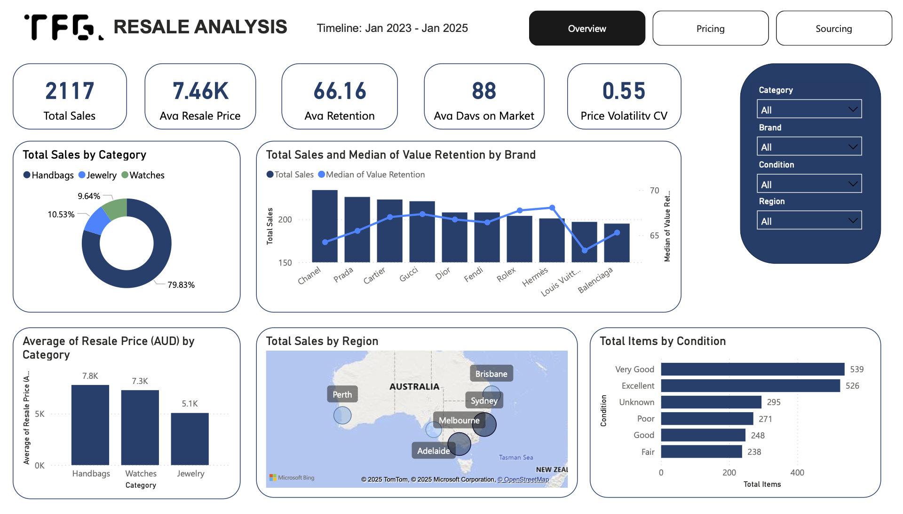
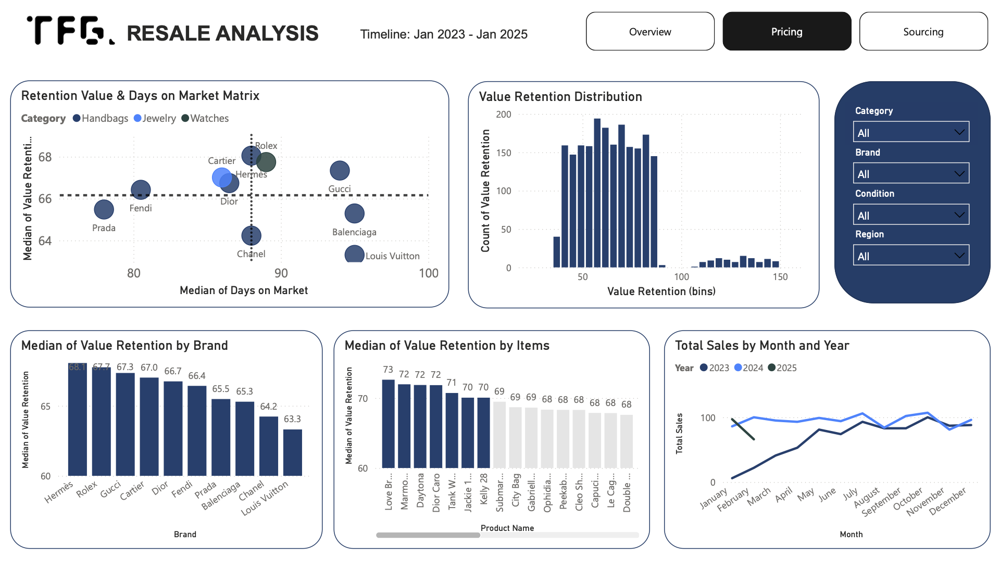
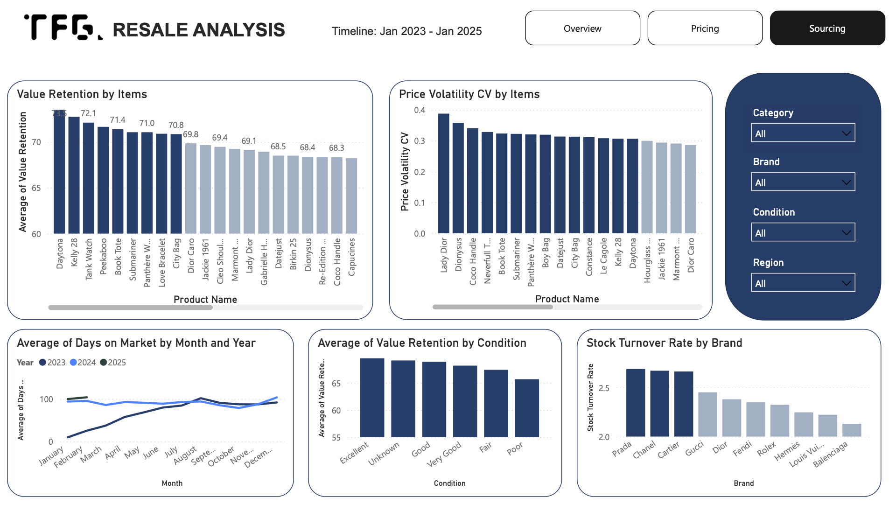

# 🛍️ Luxury Fashion Resale Market Analysis  

## 📌 The story behind
**Top Floor Gallery (TFG)** is a fashion store in Melbourne, Australia, specializing in luxury resale items from designer brands. They approach me (or vice versa?) as they want to make more data-driven decisions for their business.   

## 🚨 The challenges?
Luxury resale is a tricky business, and TFG is struggling with:
- Unstable pricing: prices fluctuate due to seasonality & demand.
- Sourcing Inefficiency: some items are depreciated in values very fast, leading to the downturn of revenue and profit.
- Inventory Optimization: some luxury items sell out quickly, while others remain in stock for too long, affecting cash flow.

## 🎯 How I frame the task?   
- 💰 **Smarter pricing** → Identify best pricing for maximum resale value  
- 📦 **Better sourcing** → Focus on brands and items that retain value  
- 🔄 **Efficient inventory** → Reduce slow-moving stock and optimize restocking  

## 📊 **The Key Takeaways (If You’re in a Hurry, Read This!)**  

### 🔥 **What did we learn?**
- Handbags are the main source of revenue for TFG
- Chanel, Prada, and Cartier are top 3 brands with highest sales
- **Luxury Watches & Jewelry retain value better** than handbags.  
- **Rolex & Hermès have the highest price retention** while **Chanel & Louis Vuitton bags depreciate the fastest** (below 50% retention).
- Sydney and Melbourne customers buy pre-owned items from TFG the most.
- TFG has pretty good sourcing strategy currently as most of the items are in Good or Excellent condition.
- Most items has 40-80% of value retention depending on other factor as well. However, items are expected to decrease at least 20% of their original value when being resold.
- The sale peaked in mid-2023 and continued to grow in 2024 with signs of seasonal fluctuation. In 2025, sales have been descreasing since the store is being reinnovated which sluggish the operation.
- **Some items in poor condition are still sold at 100%+ of their original price** due to rarity & demand.
- Prada, Chanel, and Cartier have highest stock turnover rate, suggesting a strong demand for items from these brands.
- Days on market has been increasing since mid-2023 and remained that high in 2024. This indicates that customers are no longer willing to make impulsive purchase when they saw it. This behavior could be attributed to customers tightening their budget due to economic downturn and inflation happening in Australia. 

### 🏷 **Our answer to the task?**
📌 **Pricing Strategy**:  
- As the price lost by 40-80%, TFG should use this range as a benchmark, combining with the pricing matrix (detailing below) to competitvely set the price
- Categorised brands/items into 4 groups based on Retention and Days on Market:
  - High retention + selling fast = aggresively pricing based on the average resale price of this item
  - High retention + selling slow = keep the price + marketing as an investment 
  - Low retention + selling fast = mark down for 5-10% for quick turnover pricing
  - Low retention + selling slow = price down, bundling and do promotions to clear the stocks.
  
📌 **Sourcing Strategy**  
- Prioritize sourcing **high-retention brands/items** (Rolex Daytona, Hermès Kelly 28, Cartier Tank Watch).  
- Reduce investment in **high-depreciation brands** unless they have rapid turnover.  
- Monitor **trendy items vs. classic investment pieces** to optimize sourcing decisions.

📌 **Inventory Management**  
- Restock **fast-selling items quickly** (Cleo Shoulder Bag, Tank Watch) to prevent lost sales.  
- Improve **stock rotation for slow-moving items** to avoid dead inventory.  
- Offer **promotions on aging inventory** to free up capital for new acquisitions.  

---

## 🔄 **How I made it to the end?**  
### **1️⃣ Data Collection & Cleaning - where it all begins**  
- **Dataset:** provided by TFG  
- **Tools Used:** `pandas`, `numpy`  
- **Cleaning Steps:**
  - Handled missing values  
  - Standardized brand & category names  
  - Corrected price inconsistencies  

### **2️⃣ Exploratory Data Analysis (EDA) - digging into the number**
- **Libraries Used:** `seaborn`, `matplotlib`, `pandas`
- **Key Business Questions Answered:**  
  - Which categories/brands/items retain the most value?  
  - What items are most depreciated?  
  - Which items are most sought-after?  
  - How does **seasonality affect resale value?**  

### **3️⃣ Power BI Dashboard Creation - turning data into stories**  
- **Visualized Key Metrics** → Pricing trends, demand analysis, inventory efficiency  
- **Created a multi-page interactive dashboard**  
- **Dashboard Screenshots:**  



### **4️⃣ Business Insights & Recommendations - from stories to actions**  
- 📄 **One-Page Report** summarizing key insights for TFG  
- 📊 **Detailed Slide Deck** with in-depth analysis & strategy recommendations  

## **🛠️ Tech Stack**  
- **Python**: Data Cleaning & EDA (`pandas`, `numpy`, `seaborn`, `matplotlib`)  
- **Power BI**: **Power Query** for transforming data, **DAX** for calculating key metrics, and **Dashboard** for business insights  
- **GitHub**: Project documentation & portfolio showcase  

## **📂 How this repo is organised?**  
```
📂 Luxury-Fashion-Resale-Analysis
┣ 📂 Data → Raw & cleaned datasets
┣ 📂 Notebooks → Python scripts for data processing
┣ 📂 PowerBI-Dashboard → Power BI files & screenshots
┣ 📂 Reports → Business insights & recommendations
┣ 📜 README.md → Project documentation
```
## 📢 **Want to explore the project? Here's how**  
1. Clone the repo:
```bash
git clone https://github.com/yourusername/Luxury-Fashion-Resale-Analysis.git
```
2. Run the Jupyter Notebooks for data cleaning & EDA
3. Open Power BI file to explore the dashboard
4. Review insights & recommendations in reports

##📩 **Let's connect!**
- LinkedIn: Your Name
- Portfolio: yourwebsite.com
- GitHub: yourgithub.com
