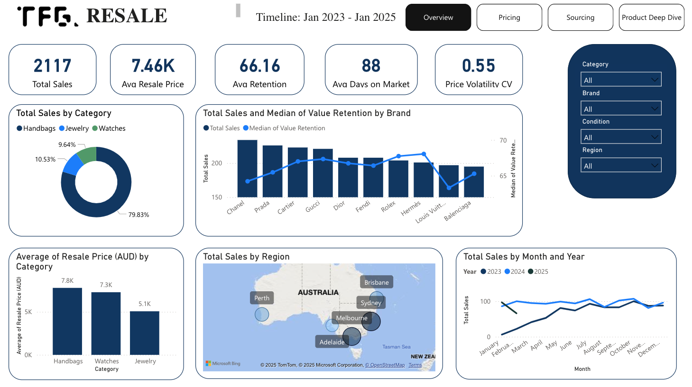
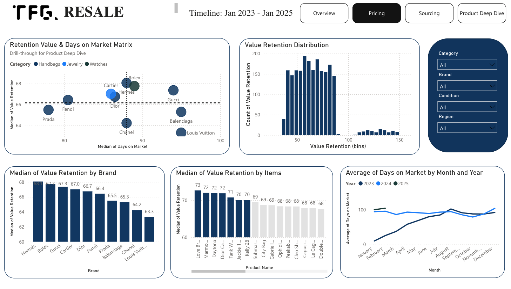
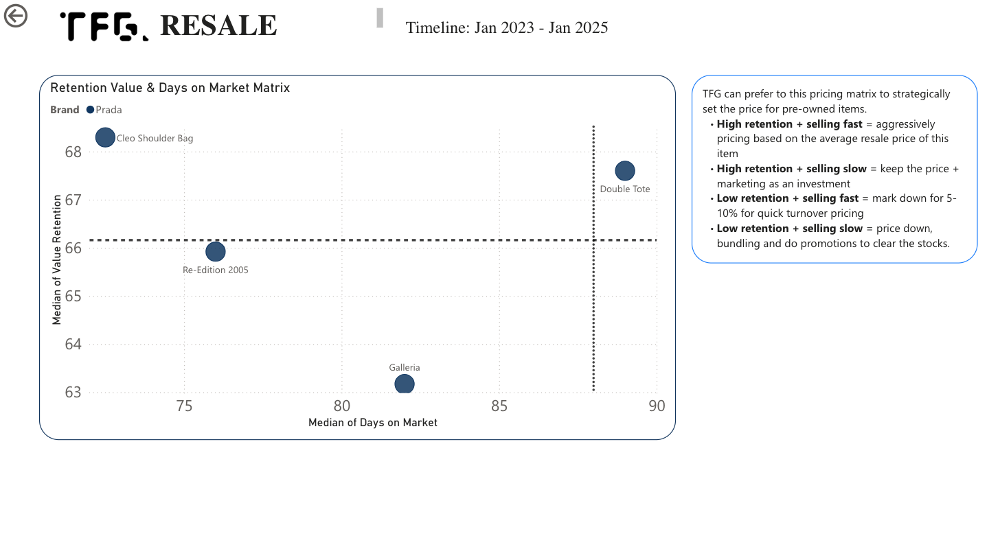
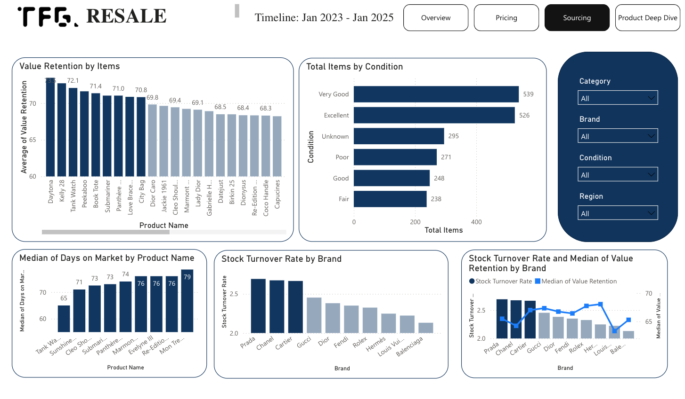

# 🛍️ Luxury Fashion Resale Market Analysis  

## 📌 The story behind
**Top Floor Gallery (TFG)** is a fashion store in Melbourne, Australia, specializing in luxury resale items from designer brands. They approach me (or vice versa?) as they want to make more data-driven decisions for their business.   

## 🚨 The challenges?
Luxury resale is a tricky business, and TFG is struggling with:
- Unstable pricing: prices fluctuate due to seasonality & demand.
- Sourcing Inefficiency: some items are depreciated in values very fast, leading to the downturn of revenue and profit.
- Inventory Optimization: some luxury items sell out quickly, while others remain in stock for too long, affecting cash flow.

## 🎯 How I frame the task?   
- 💰 **Smarter pricing** → Identify best pricing for maximum resale value  
- 📦 **Better sourcing** → Focus on brands and items that retain value  
- 🔄 **Efficient inventory** → Reduce slow-moving stock and optimize restocking  

## 📊 **The Key Takeaways (If You’re in a Hurry, Read This!)**  

### 🔥 **What did we learn?**
💰 **Revenue & Sales Trends**
- Handbags drive the most revenue for TFG.
- Chanel, Prada, and Cartier are the top-selling brands in terms of volume.
- Sydney & Melbourne customers are the most active buyers of pre-owned luxury items.
- Sales peaked in mid-2023 and grew in 2024, showing seasonal fluctuations.
- Sales dropped in 2025 due to store renovations affecting operations.

📈 **Pricing & Value Retention**
- Luxury Watches & Jewelry hold value better than handbags.
- Rolex & Hermès have the highest value retention, while Chanel & Louis Vuitton bags depreciate the fastest (below 50% retention).
- Most items retain 40-80% of their original price, but resale value is expected to drop at least 20% on average.
- Some poor-condition items still sell at 100%+ of their original price due to rarity and high demand.

📦 **Inventory & Sourcing Efficiency**
- TFG's sourcing strategy is currently very good – most items are in Good or Excellent condition.
- Prada, Chanel, and Cartier have the highest stock turnover rate, indicating strong demand.
- Days on Market has increased since mid-2023 and remained high in 2024, suggesting customers are no longer making impulsive purchases.
- Economic downturn & inflation in Australia may be causing buyers to be more cautious with spending.

### 🏷 **Our answer to the task?**
📌 **Pricing Strategy**:  
- As the price lost by 40-80%, TFG should use this range as a benchmark, combining with the pricing matrix (detailing below) to competitvely set the price
- Categorised brands/items into 4 groups based on Retention and Days on Market:
  - High retention + selling fast = aggresively pricing based on the average resale price of this item
  - High retention + selling slow = keep the price + marketing as an investment 
  - Low retention + selling fast = mark down for 5-10% for quick turnover pricing
  - Low retention + selling slow = price down, bundling and do promotions to clear the stocks.
  
📌 **Sourcing Strategy**  
- Prioritize sourcing **high-retention brands/items** (Rolex Daytona, Hermès Kelly 28, Cartier Tank Watch).  
- Reduce investment in **high-depreciation brands** unless they have rapid turnover.  
- Monitor **trendy items vs. classic investment pieces** to optimize sourcing decisions.

📌 **Inventory Management**  
- Restock **fast-selling items quickly** (Cleo Shoulder Bag, Tank Watch) to prevent lost sales.  
- Improve **stock rotation for slow-moving items** to avoid dead inventory.  
- Offer **promotions on aging inventory** to free up capital for new acquisitions.  
---

## 🔄 **How I made it to the end?**  
### **1️⃣ Data Collection & Cleaning - where it all begins**  
- **Dataset:** provided by TFG  
- **Tools Used:** `pandas`, `numpy`  
- **Cleaning Steps:**
  - Handled missing values  
  - Standardized brand & category names  
  - Corrected price inconsistencies  

### **2️⃣ Exploratory Data Analysis (EDA) - digging into the number**
- **Libraries Used:** `seaborn`, `matplotlib`, `pandas`
- **Key Business Questions Answered:**  
  - Which categories/brands/items retain the most value?  
  - What items are most depreciated?  
  - Which items are most sought-after?  
  - How does **seasonality affect resale value?**  

### **3️⃣ Power BI Dashboard Creation - turning data into stories**  
- **Visualized Key Metrics** → Pricing trends, demand analysis, inventory efficiency with drill-through visuals for product deep dive 
- **Access the dashboard**: [Here](https://app.powerbi.com/groups/me/reports/8df73c18-f453-41e4-8cef-dbc973ef690b?ctid=9aee26d8-97c2-4fad-8900-96735f6dc73f&pbi_source=linkShare) 
- **Dashboard Screenshots:**  




### **4️⃣ Business Insights & Recommendations - from stories to actions**  
- 📊 **Detailed Slide Deck** with in-depth analysis & strategy recommendations  

## **🛠️ Tech Stack**  
- **Python**: Data Cleaning & EDA (`pandas`, `numpy`, `seaborn`, `matplotlib`)  
- **Power BI**: **Power Query** for transforming data, **DAX** for calculating key metrics, and **Dashboard** for business insights  
- **GitHub**: Project documentation & portfolio showcase  

## **📂 How this repo is organised?**  
```
📂 Luxury-Fashion-Resale-Analysis
┣ 📂 Data → Raw & cleaned datasets
┣ 📂 Notebooks → Python scripts for data processing
┣ 📂 PowerBI-Dashboard → Power BI files & screenshots
┣ 📂 Reports → Detaied business insights & recommendations
┣ 📜 README.md → Project documentation
```

##📩 **Let's connect!**
- LinkedIn: [Christian (An) Quach](linkedin.com/in/anquach01)
